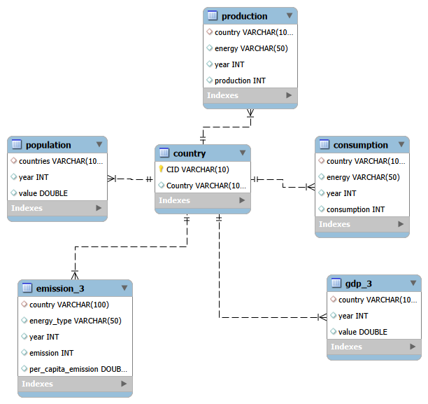
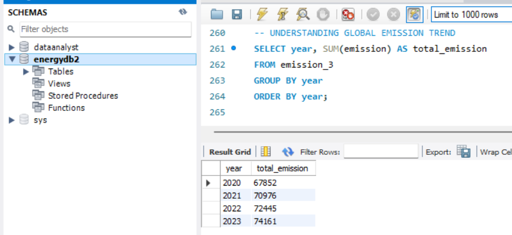
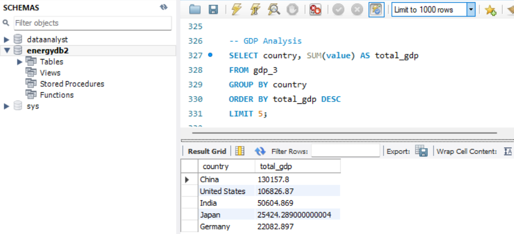
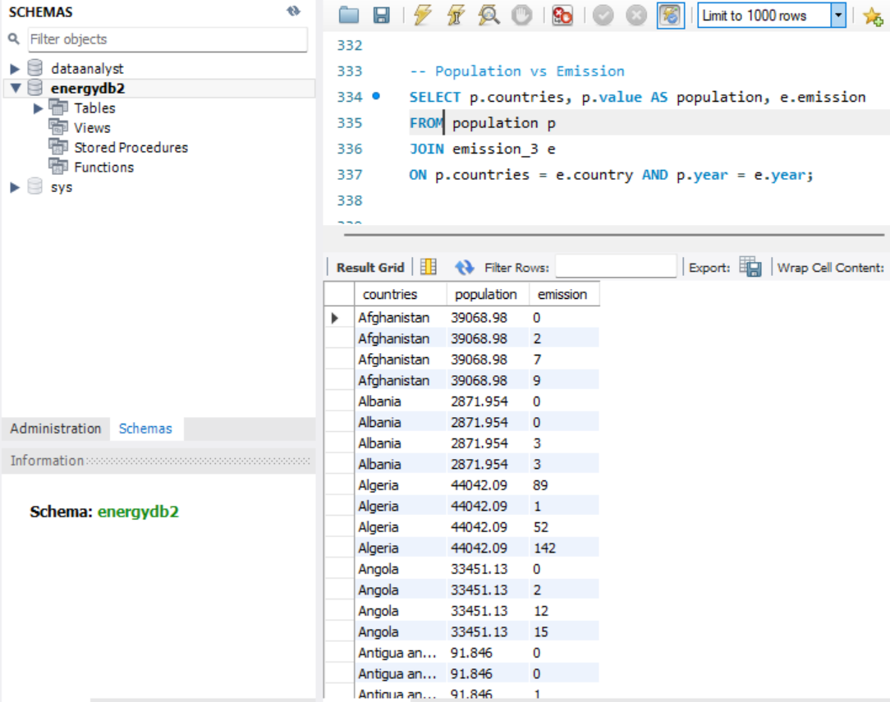

# 🌍 World Energy Consumption Analysis (SQL Project)


---

## 📌 Project Overview

This project analyzes **global energy consumption, emissions, GDP, and population trends** using SQL.

Using real-world datasets from energy tracking organizations, this project explores how **economic growth, population, and energy usage** are interconnected across countries.

---

## 🎯 Objectives

- Analyze global energy consumption patterns  
- Compare GDP growth with emissions  
- Identify top emission-contributing countries  
- Understand population impact on energy demand  
- Generate insights using SQL queries  

---

## 🗂️ Dataset Description

This project is based on 6 relational tables:

- `country` (central table)  
- `emission_3`  
- `consumption`  
- `production`  
- `gdp_3`  
- `population`  

All tables are linked using **foreign key relationships** to ensure data integrity.

---
## 🗺️ Database Schema (ERD)

The following Entity Relationship Diagram represents the structure of the database and relationships between tables:


---

## 🗺️ Database Schema (ERD)

The following Entity Relationship Diagram represents the structure of the database and relationships between tables:



📁 Editable ERD file available: `ERD/erd_diagram.mwb`
---

## 🧠 Key Analysis Performed

### 🔹 General Analysis
- Total emissions per country (latest year)  
- Top countries by GDP  
- Energy production vs consumption comparison  

### 🔹 Trend Analysis
- Year-over-year emission trends  
- GDP growth over time  
- Population vs emission relationship  

### 🔹 Advanced Analysis
- Emission-to-GDP ratio  
- Per capita energy consumption  
- Countries improving emission efficiency  
- Correlation between GDP and energy production  

---

## 🛠️ Tech Stack

- SQL (MySQL)  
- Excel (Data Cleaning)  
- PowerPoint (Presentation)  
- GitHub  

---

## 📊 Sample SQL Query

```sql
SELECT country, SUM(emission) AS total_emission
FROM emission_3
GROUP BY country
ORDER BY total_emission DESC;
```

---

## 📸 Project Screenshots

### 📉 Emission Trend


### 📊 GDP vs Emission


### 🌍 Population Impact


---

## 📈 Key Insights

- High GDP countries generally have higher emissions  
- Population growth strongly impacts energy consumption  
- Some countries reduced emissions per capita over time  
- Energy consumption and production are not always balanced  

---

## 📁 How to Run

1. Create a database in MySQL  
2. Import CSV files  
3. Run `schema.sql`  
4. Execute queries from `queries.sql`  

---

## 🧠 What This Project Demonstrates

- Strong SQL fundamentals  
- Real-world data analysis  
- Ability to derive insights from structured datasets  
- Understanding of economic and environmental relationships  

---

## 👤 Author

**Amar Kanth V**  
Data Analyst  

---

## 📬 Connect

Feel free to connect with me on LinkedIn  

---

⭐ If you like this project, consider giving it a star!
